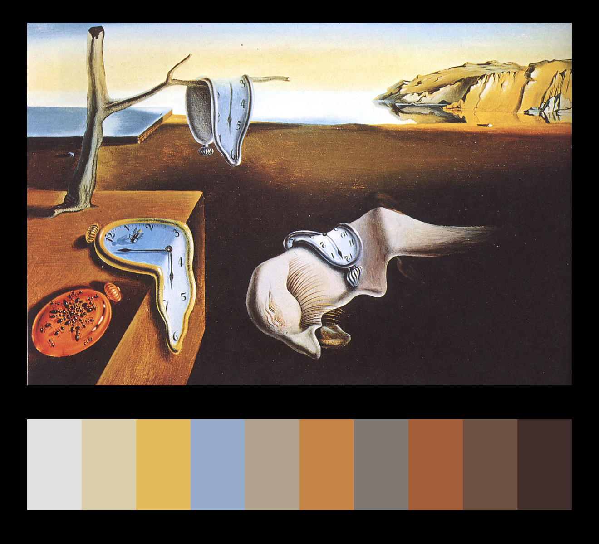
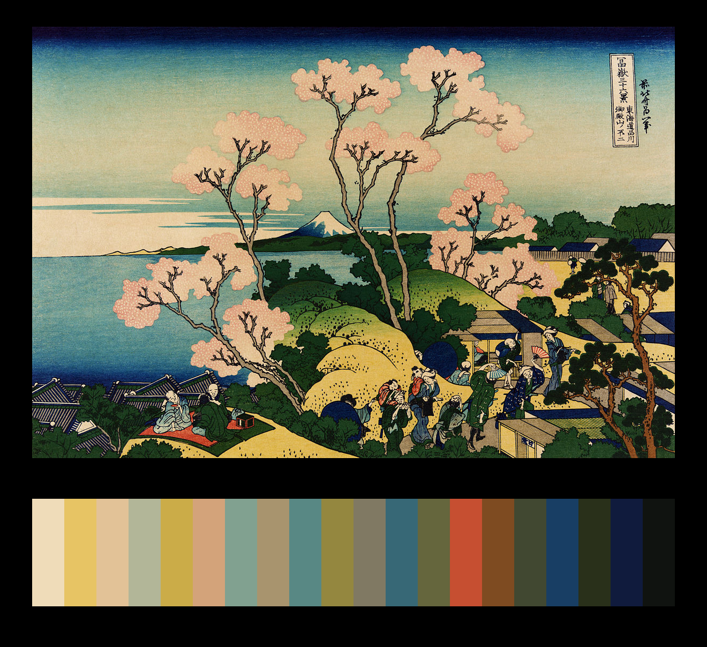

## imgpalette

If of any use to anyone, imgpalette creates a palette of colours based on a given Image. 
It uses the KMeans cluster algorithm. [fyi](https://scikit-learn.org/stable/modules/clustering.html#k-means)

### Requirements

Python 3.7 or higher.

### Installation

1 - Clone this repo.

2 - Inside repo folder run commands below

	python setup.py install
	
or for the pip's

	python setup.py bdist_wheel
	
3 - Inside generated dist folder run 

	pip install imgpalette-1.0.0-py3-none-any.whl
	
ooooooooor just use the code in imgpalette.py

### Usage

	from imgpalette import palette_from_image
	# Use url or filepath.
	img = 'https://d2jv9003bew7ag.cloudfront.net/uploads/Salvador-Dali-The-Persistence-of-Memory-1931-c.jpg'  
	# Make palette. Returns a combination of the original Image, the palette and the backround. 
	result = palette_from_image(img)
	# Use result[1] for palette only.
	result[0]

Returns

	
### Additional info	

in palette_from_image you can set the number of colors in the palette and a filename when downloading from the web.

	img = 'https://upload.wikimedia.org/wikipedia/commons/thumb/1/1f/Katsushika_Hokusai%2C_Goten-yama_hill%2C_Shinagawa_on_the_T%C5%8Dkaid%C5%8D%2C_ca._1832.jpg/1200px-Katsushika_Hokusai%2C_Goten-yama_hill%2C_Shinagawa_on_the_T%C5%8Dkaid%C5%8D%2C_ca._1832.jpg'  

	result = palette_from_image(img, clusters=20, fname='Fuji from Gotenyama at Shinagawa on the Tokaido')

	result[0]

#
That's all folks

